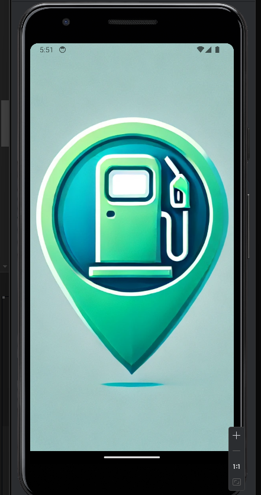
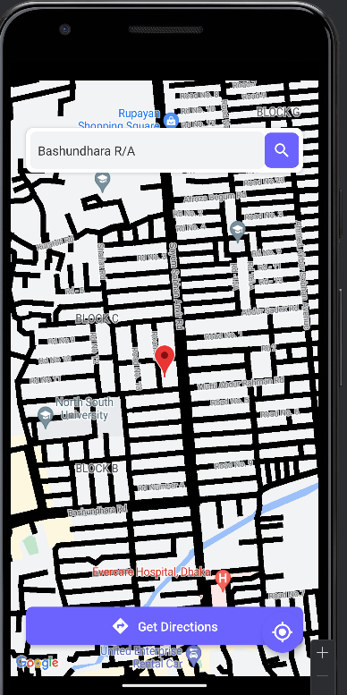

# FuelFinder - Location-Based Fuel Station Finder

FuelFinder is a simple, user-friendly mobile app developed using **Expo**, **React Native**, and **React Native Paper**. It allows users to locate the 5 nearest fuel stations from their current location, get directions to a selected station, and view real-time location updates on a map. The app provides a clean, responsive, and intuitive UI, suitable for both mobile and tablet layouts.

## Features

- **Current Location Tracking**: The app fetches and displays your current location using the Expo Location API.
- **Search Bar**: Users can search for any location, and the map will automatically center on the searched location.
- **Get Directions**: The app provides directions to the searched location using the OpenRouteService API.
- **Responsive Layout**: The app is fully responsive and adapts to various screen sizes, offering an optimal user experience.
- **Draggable Map Markers**: The app includes draggable markers to set custom locations.
- **Real-time Map Updates**: The map updates in real-time based on your current location.

## Installation

To run this project locally, follow these steps:

### 1. Clone the repository
```bash
git clone https://github.com/NoManNayeem/Expo-Map.git
```

### 2. Install dependencies
```bash
cd FuelFinder
npm install
```

### 3. Set up environment variables
Create an `.env` file in the root directory and add your OpenRouteService API key as follows:
```bash
OpenRouteServiceApi_Key=your_open_route_service_api_key_here
```

### 4. Start the development server
```bash
npx expo start
```
This will start the Expo development server, and you can scan the QR code to run the app on your mobile device using the Expo Go app.

### 5. Build APK (optional)
If you want to build an APK for Android:
```bash
npx expo build:android
```

### Mobile Layout

<div style="display: flex; justify-content: space-between;">
  
  
</div>


## Technologies Used

- **React Native**: Mobile framework for cross-platform app development.
- **Expo**: Framework and platform for universal React applications.
- **React Native Maps**: Component to integrate maps into the app.
- **OpenRouteService API**: Used for retrieving route and direction information.
- **Axios**: For making HTTP requests.
- **React Native Paper**: Material Design library for UI components.

## Folder Structure

```bash
├── components
│   ├── DirectionsButton.js       # Button to fetch and show directions
│   ├── MapComponent.js           # Map view with user and searched locations
│   └── SearchBar.js              # Search bar to find locations on the map
├── assets                        # Assets such as icons, images
├── screenshots                   # Folder to store screenshots for the README
├── App.js                        # Main app file
└── README.md                     # Project documentation
```

## Future Improvements

- Implement a fuel price comparison feature between stations.
- Add filters for types of fuel (petrol, diesel, etc.).
- Integrate more location-based services, such as car repair shops.

## License

This project is licensed under the MIT License - see the [LICENSE](LICENSE) file for details.

## Contact

If you have any questions or suggestions regarding this project, feel free to contact:

- Name: Your Name
- Email: your.email@example.com
